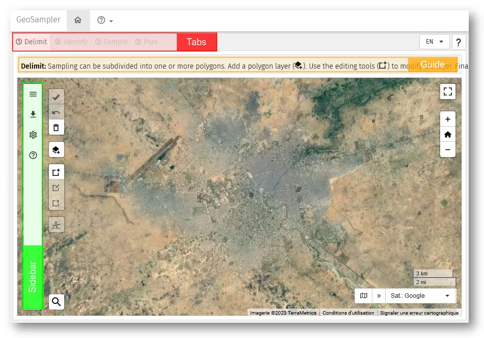
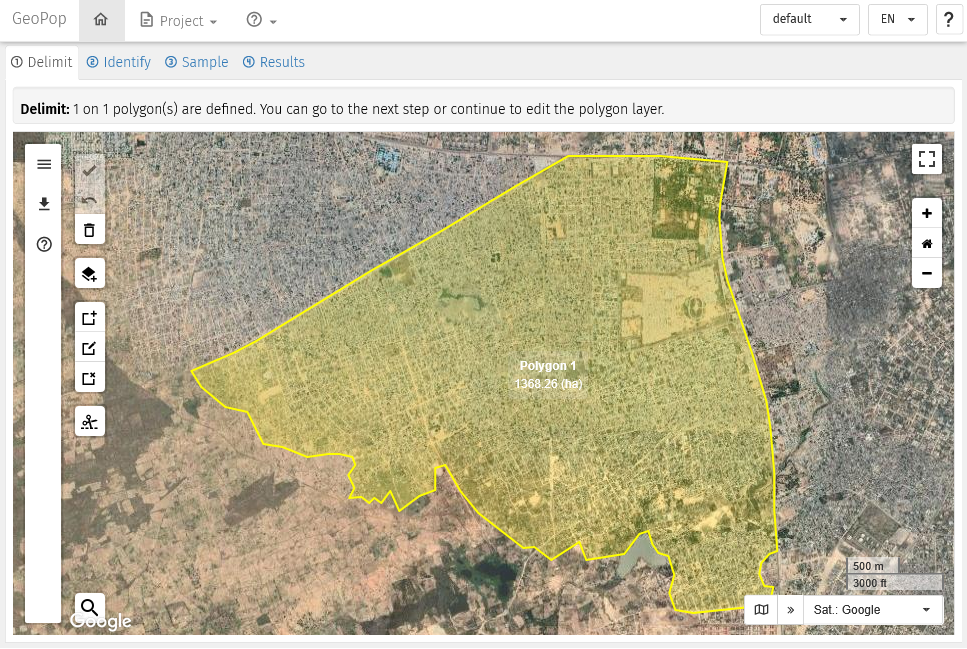
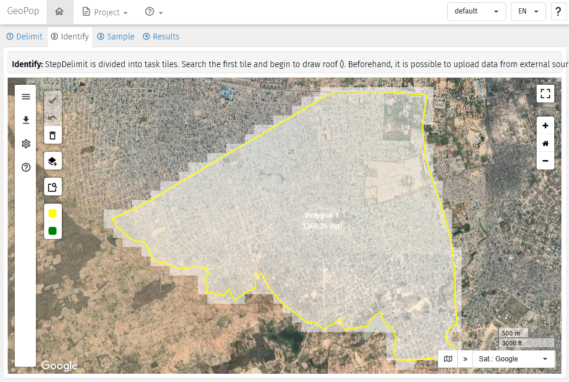
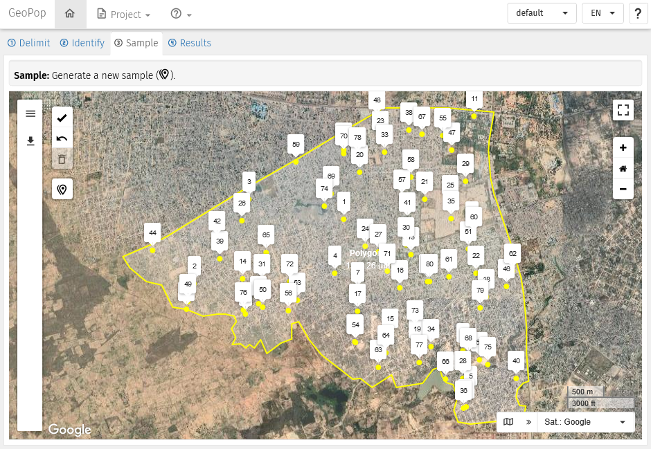
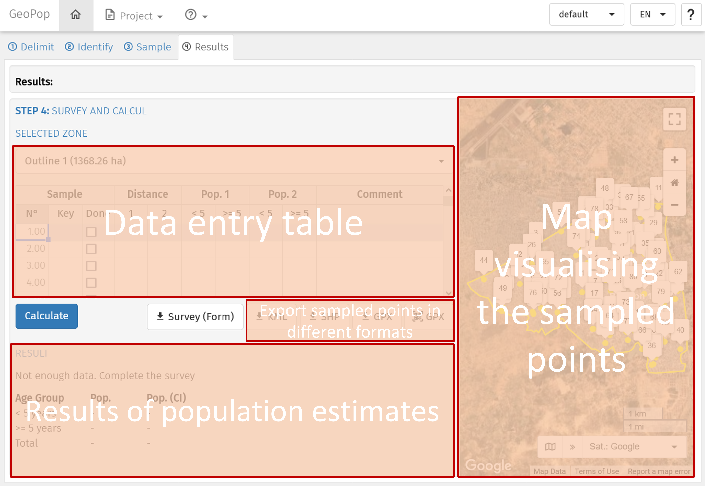

> If you are not familiar with GeoSampler here is where to start. Or you you want a refresh on how to use GeoSampler.

# Get access to GeoSampler

## Online

GeoSampler is available **online** at the <a href=https://apps.msf.net/geosampler-01 target="_blank">MSF-Epicentre Data and Apps</a> platform. If you have not the rights to access to the online version, please contact the Epicentre training unit (<Elise.RODARY@epicentre.msf.org>).

## On your server/computer

GeoSampler can also be deployed **on any server or on a personal computer**, as long as the license terms are followed.

In any way, the application works better if:

- It runs on a modern browser (i.e., [Firefox](https://www.mozilla.org/firefox/new/), [Chrome](https://www.google.com/chrome/), [Safari](https://www.apple.com/safari/))
- It runs on a fast and stable internet connection to let a smooth rendering of the remote sensing images.

# Overview

When you connect to GeoSampler, the application appears as in the image below. Most of the browser window displays a satellite image with buttons and menus on the sides of the image.

The <a class="text-red">**Tabs ribbon**</a>, located on the top-left above the satellite image, displays 4 tabs:

<a class='tab-style'>**&#9312; Delimit**  </a> &nbsp;
<a class='tab-style'>**&#9313; Identify** </a> &nbsp;
<a class='tab-style'>**&#9314; Sample**   </a> &nbsp;
<a class='tab-style'>**&#9315; Results**  </a> &nbsp;

The 4 tabs allow to execute in sequence the **4 major steps** to estimate population sizes. Each tab allows to display a new page to execute specific tasks. A the opening of a new GeoSampler session, the page <a class='tab-style'>**&#9312; Delimit**  </a>&nbsp;is displayed, while the other tabs are temporarily deactivated. Access to the other pages will be possible when tasks in the <a class='tab-style'>**&#9312; Delimit**  </a>&nbsp;page are validated.

The <a class="text-red">**Info ribbon**</a> located just below the Tabs ribbon, provide basic information on what is expected to be done in the page displayed.

The <a class="text-red">**Zooming tools**</a>, located on the top-right side of the image, allow to zoom in and out. The icon at the very top allows to toggle to the FullScreen mode.

The <a class="text-red">**Image tools**</a>, located on the bottom-right side of the image, allow to select the source and type of satellite image to be displayed.

The <a class="text-red">**Edit tools**</a>, located on the left side of the image, contains several buttons and a menu, and it changes depending on the page displayed.

The view of the page may look slightly different depending on the resolution of your screen.

  
  

**GeoSampler as it appears in a new session with location of the main functions**

# Pages

## Page <a class='tab-style'>**&#9312; Delimit**  </a>

This page is meant to accomplish the first task which is to **delimit with one or more polygons the area of interest**. It is possible to upload a polygon from an external file and/or draw yourself one or more polygons. Imported or newly created polygons can be edit afterwards.

**Edit tools in this page:**

* `<i class="mdi mdi-check-bold " role="presentation" aria-label="check-bold icon"></i>`{=html} **Validate** the tasks in the page and allow to move to the next pages.
* `<i class="mdi mdi-undo " role="presentation" aria-label="undo icon"></i>`{=html} **Undo** the previous action. Only one undo is possible.
* `<i class="mdi mdi-delete-outline " role="presentation" aria-label="delete-outline icon"></i>`{=html} **Delete**. This action throw in the bin all polygons imported or created. The application is then set to the initial status.
* `<i class="mdi mdi-layers-plus mdi-18px" role="presentation" aria-label="layers-plus icon"></i>`{=html} **Add a polygon layer** from an external source or file. Follow the pop-up window to do so.
* `<i class="mdi mdi-shape-square-plus " role="presentation" aria-label="shape-square-plus icon"></i>`{=html} Activate the **Draw a new polygon** mode. Click on the icon and click on the image to start drawing a polygon. At each left-click of the mouse a new vertex is created. The polygon is created when the last click of the mouse will overlap the first vertex.
* `<i class="mdi mdi-square-edit-outline " role="presentation" aria-label="square-edit-outline icon"></i>`{=html} Activate the **Edit a polygon** mode. Click on the icon and select the polygon to be edited. The vertexes of the selected polygons can now be moved or deleted. It is also possible to add new vertexes. Re-click on the icon to exit from the mode edit.
* `<i class="mdi mdi-shape-square-remove " role="presentation" aria-label="shape-square-remove icon"></i>`{=html} Activate the **Delete polygon** mode. Click on the icon and then click on the polygon (or on the polygons one by one) to be deleted. Re-click on the icon to exit from the mode delete.
* `<i class="mdi mdi-scissors-cutting " role="presentation" aria-label="scissors-cutting icon"></i>`{=html} **Cut a polygon** allows to split a polygon into two by drawing a line throughout the polygon to be split. Make sure that the first and last vertex of the line fall outside the polygon to be split.

  
  

**Page Delimit: a polygon delimit the area of interest**

Validate at least one polygon to move th the next pages.

If you opted for the [Roof Simple-Random sampling]() method, move to Page <a class='tab-style'>**&#9313; Identify** </a>.

If you opted for the [Quadrats]() or [T-square]() method, move to Page <a class='tab-style'>**&#9314; Sample**   </a>.

## Page <a class='tab-style'>**&#9313; Identify** </a>

Page is to be used only if you opted for the [Roof Simple-Random sampling]() method.

In this page the application has created tiles of 150 metres per side to cover the polygon(s) saved in the previous page. Tiles are displayed in white semi-transparent shade.

Tiles are examined one by one, and roofs displayed in the satellite image are pinpointed with the left-click of the mouse. Erroneous marks can be deleted by left-clicking on the mark to be deleted.

When all roofs are marked the tiles can be marked as checked `<i class="mdi mdi-square-rounded mdi-18px" style="color: yellow" role="presentation" aria-label="square-rounded icon"></i>`{=html} or valid `<i class="mdi mdi-square-rounded mdi-18px" style="color: green" role="presentation" aria-label="square-rounded icon"></i>`{=html}.

**Edit tools in this page:**
* `<i class="mdi mdi-check-bold " role="presentation" aria-label="check-bold icon"></i>`{=html} **Validate** the tasks in the page and allow to move to the next pages.
* `<i class="mdi mdi-undo " role="presentation" aria-label="undo icon"></i>`{=html} **Undo** the previous action. Only one undo is possible.
* `<i class="mdi mdi-delete-outline " role="presentation" aria-label="delete-outline icon"></i>`{=html} **Delete all points**. This action throw in the bin all points imported or created. The polygon is kept.
* `<i class="mdi mdi-layers-plus mdi-18px" role="presentation" aria-label="layers-plus icon"></i>`{=html} **Import points for external source**. Follow the pop-up window to do so.
* `<i class="mdi mdi-feature-search-outline " role="presentation" aria-label="feature-search-outline icon"></i>`{=html} **Search and Identify** Chick to the icon to to select and zoom to the first tile.
* `<i class="mdi mdi-square-rounded mdi-18px" style="color: yellow" role="presentation" aria-label="square-rounded icon"></i>`{=html} **Checked** Label the tile as “Checked”. Same action can be done by pressing the [SPACE] key on the keyboard.  By pressing again on the [SPACE] key, the focus moves on the nearest tile with white border.
* `<i class="mdi mdi-square-rounded mdi-18px" style="color: green" role="presentation" aria-label="square-rounded icon"></i>`{=html} **Valid** Label the tile as “Valid”. Same action can be done by pressing the [ENTER] key on the keyboard. By pressing again on the [ENTER] key, the focus moves on the nearest tile with yellow border.

  
  

**Page Identify: the polygon is covered with square white tiles of 150 metres per side**

## Page <a class='tab-style'>**&#9314; Sample**   </a>

This page is meant to allow selecting a sample of points within one or more polygons or from a list of point previously identified, depending of the sampling method chose.

**Edit tools in this page:**

* `<i class="mdi mdi-check-bold " role="presentation" aria-label="check-bold icon"></i>`{=html} **Validate** the tasks in the page and allow to move to the next pages.
* `<i class="mdi mdi-undo " role="presentation" aria-label="undo icon"></i>`{=html} **Undo** the previous action. Only one undo is possible.
* `<i class="mdi mdi-delete-outline " role="presentation" aria-label="delete-outline icon"></i>`{=html} **Delete**. This action deletes the selection of the points.
* `<i class="mdi mdi-layers-plus mdi-18px" role="presentation" aria-label="layers-plus icon"></i>`{=html} **Add a sample layer** from an external source or file. Follow the pop-up window to do so.
* `<i class="mdi mdi-map-marker-multiple-outline " role="presentation" aria-label="map-marker-multiple-outline icon"></i>`{=html} **New Sample**. Follow the pop-up window to select the sampling method and the number of points to be sampled.

  
  

**Page Sample: 80 points randomly selected (T-square method)**

Before sampling, you need to select at least one polygon frow which the points are to be sampled. Do so even if there is only one polygon. For the [Quadrats]() method you need to chose also the size of the quadrats.

## Page <a class='tab-style'>**&#9315; Results**  </a>

The page is divided into four main parts:

On the top-left: the <a class="text-red">**Data entry table**</a>. The table is different according to the chosen sampling method.

In the centre: the buttons to <a class="text-red">**Export sampled points in different formats**</a>. Useful for carrying out the field activity.

On the right: the <a class="text-red">**Map visualising the sampled points**</a>.

On the bottom-left: the <a class="text-red">**Results of population estimates**</a>. Results will be displayed after having entered data in th table an running the calculation.

  
  

**Page Results: Description of the parts in which the page is divided**

