```{r, echo = FALSE, message = FALSE, warning = FALSE}
source(here::here('vignettes/setup.R'), local = TRUE)
```

> A step-by-step tutorial to do a random sampling by roof identification followed

Before starting you need to check the following:

- you have access to `r pkg_infos$title` (online or offline with a capsule)
- you have a modern smartphone with [OsmAnd](https://osmand.net/) and/or a GPS device (i.e. Garmin *eTrex*)

# Overview

This method consists in combining the analysis of a satellite image for the identification of shelters (roofs), followed by a random selection of a sample. This has been allowed by the `r pkg_infos$title` app.

This is done in 4 steps:

1. **Delimit**: Using the `r pkg_infos$title` app, you will define a polygone corresponding to the area of interest

2. **Identify**: After, you will scan a recent satellite image and manually click on each roof which seems to be a residential building. In the polygon of interest, this should end up in an "exhaustive" ensemble of roofs

3. **Sample**: From this ensemble, `r pkg_infos$title` can randomly generate a sample of the desired size, and this random sample of GPS coordinates can then be exported to a GPS device for field data collection in each of the household living under the sampled roofs

4. **Plan**: At the office, plan your survey work with the generated sample

# Step-by-Step Guide

> How to do a random sample of Masai Lodge

## Open `r pkg_infos$title`

1. **Launch** `r pkg_infos$title` which has been installed on your computer.

    Two options:

    * Use the desktop shortcut.

      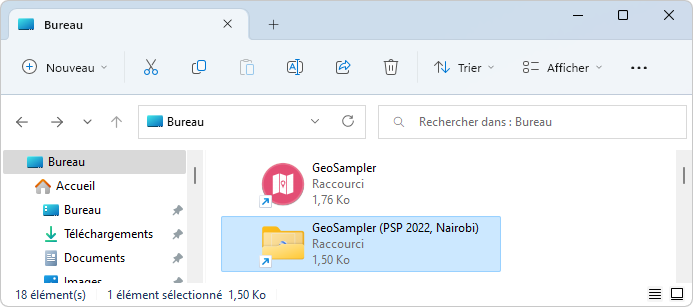<br><br>

    * Use the **launch.bat** file in the `r pkg_infos$title` folder root.

      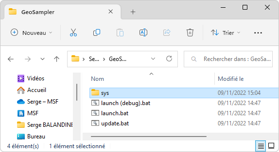<br><br>

2. A DOS window opens at the center of the screen, asking you to choose a command.

    <br><br>

3. Choose `r pkg_infos$title` (1 [ENTER]). After a few seconds, `r pkg_infos$title` is displayed in your browser. Select **Random Sample**.

    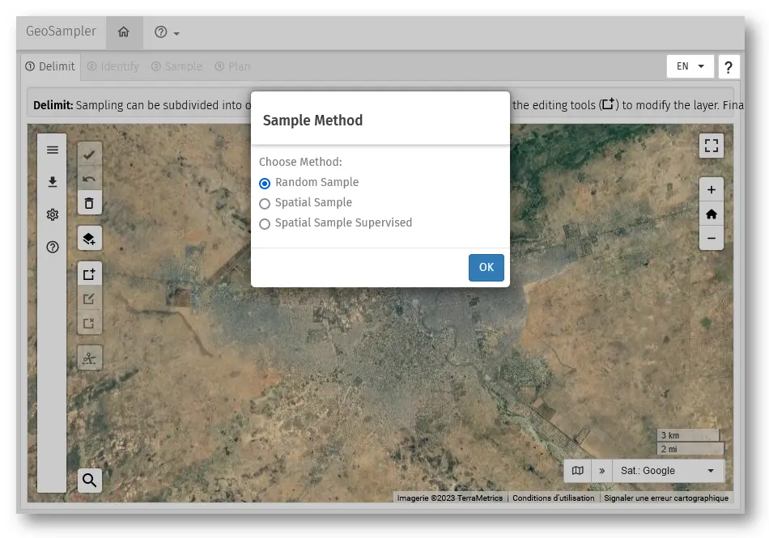

## Interface


* <font color="red">**Tabs**</font>: 4 tabs corresponding of the main steps to follow in the procedure. They will be used sequentially 1, 2, 3, then 4.
* <font color="orange">**Guide**</font>: Provide basic information on what is expected to be done in the page displayed..
* <font color="green">**Sidebar**</font>: ...

## Step 1: Delimit

In this page, you will define the area of interest (the masai lodge).

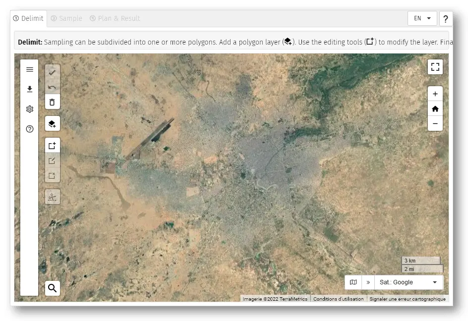

### Steps

There are 2 options :

- **Drawing a polygon directly**, or
- **Uploading an existing  polygone** from an external file (here we practice the 2nd option).

#### Drawing a polygon directly

**A. Find the Masai Lodge**

1. Click on the button **Search** (`r epi.icons::icon_mdi('magnify')`) on the bottom-left. You can now type a location.<br>
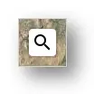 >> 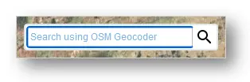

2. Type in "Masai Lodge". You find two proposals.<br>
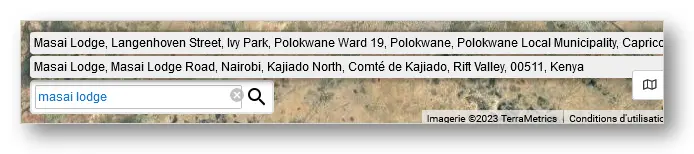

3. Click on the first proposal (Masai Lodga ... Kenya). Map move to the Masai Lodge (On the south-east of the map).<br>
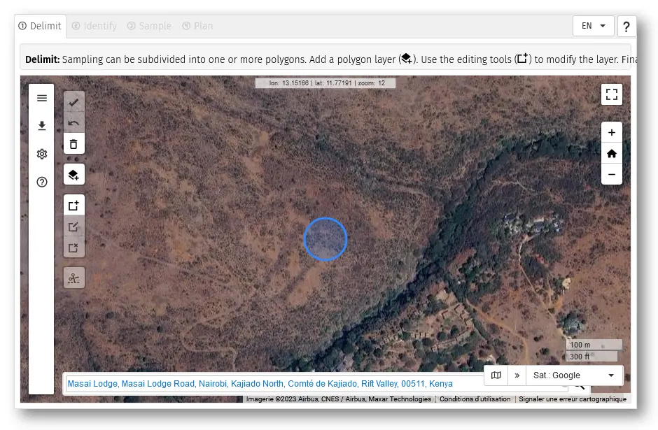

4. Click on the map to finish.

**B. Draw the Masai Lodge delimitation**

1. Use the mouse to place the Masai Lodge in the centre of the app window

2. Click on the button **Draw a polygon** (`r epi.icons::icon_mdi('shape-square-plus')`).

3. Click on the map to draw the polygon
    - Move the pointer to the image and left-click on the image just outside the refugee camp to mark the first vertex of the polygon
    - By moving the mouse clockwise (or anticlockwise) a dashed line is drawn between the first vertex and the mouse pointer
    - Mark the second vertex with the aim to surround all camp dwellings and exclude non inhabited zones. With the mark of the second vertex, the dashed line turns into a solid one (see image below)

    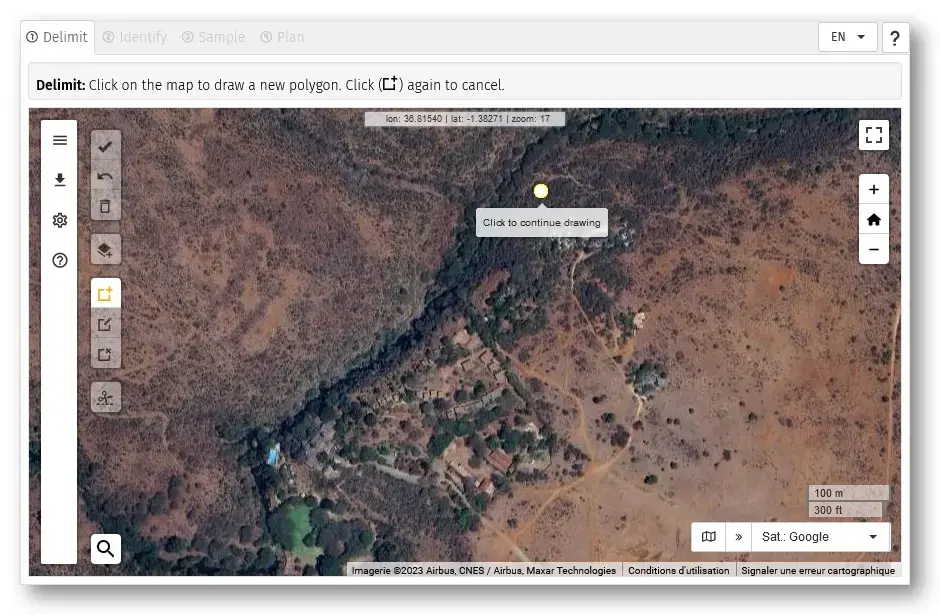

4. Click on the polygon to select it.

5. Click on the button **Save** (`r epi.icons::icon_mdi('check-bold')`). Confirm with **OK**.

6. Now, you can go to the next step **Identify**

### Uploading an existing polygone

1. Click on the button **Add a polygon layer...** (`r epi.icons::icon_mdi('layers-plus')`). This dialog box popup.<br>
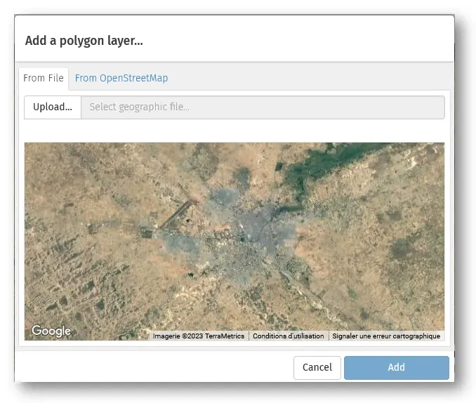

2. Click on the button **Upload...** and in the file dialog, navigate in your folders and select the appropriate file ([masai-lodge.kmz](./data/psp/2022.nairobi/masai-lodge.kmz)).<br>
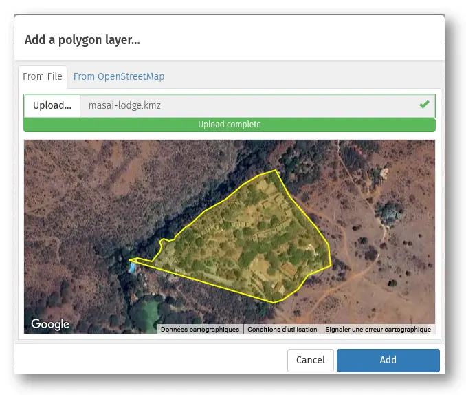

3. Click on the button **Add a polygon layer...** when the upload is complete.

4. Click on the polygon to select it.

5. Click on the button **Save** (`r epi.icons::icon_mdi('check-bold')`). Confirm with **OK**.

6. Now, you can go to the next step **Identify**

[As in the other method above, do not forget to validate `r epi.icons::icon_mdi('check-bold')` to be able to proceed to step 2 (tab "Identify")  !]{.red-text}

## Step 2: Identify

In this step, the objective is to inspect the satellite and mark shelters by clicking everywhere there seem to be a roof. In this process, the app will divide the polygon into 'tiles'.

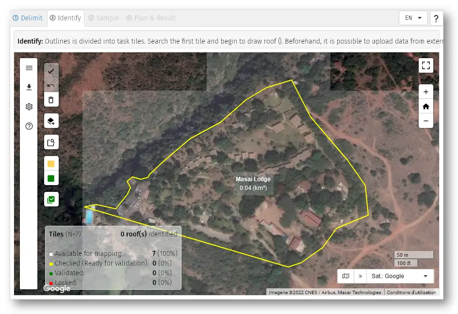

The polygon has been divided into "tiles" by the `r pkg_infos$title` app (these are virtual squares of 150m side ) with a white, semi-transparent border.  For each tile, use the following procedure :

::: {.alert .alert-info}
**Rules for roof identification**

Before proceeding further, please read these rules so that you can apply them.

* Roof size : Point roofs of any size above **3 meters** on both side
* Roof contiguous: When two or more roofs are contiguous (even if different size / color)  mark **only one point**

:::

[Before identifying roofs, **activate your polygon by clicking in it** ! ]{.red-text}

### Steps

1. To inspect a tile, you can:

    * Click on the button **Search and identify** (`r epi.icons::icon_mdi('feature-search-outline')`).
    * Click on the map inside the polygon.
    * Use the arrows keys<br>

    Map zoom and the tile of interest appears at center of the screen with a white border.

    

2. Click to mark every roof.

3. When all roofs have been marked in a tile, you can

      * Click on the button **Check** (`r epi.icons::icon_mdi('square-rounded', color = "yellow")`).
      * Type [**SPACE**]

    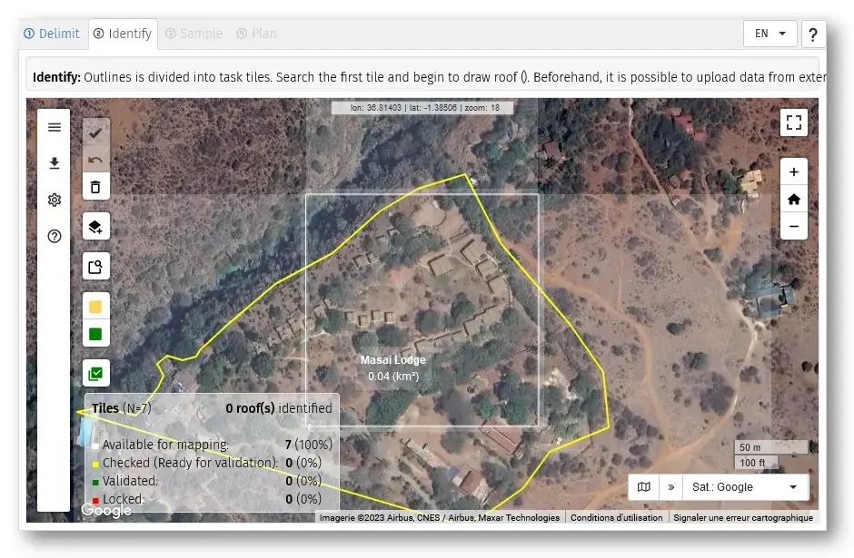

    in this state the tile changes to a yellow border, _see picture below on the bottom-right_. By clicking a second time on **SPACE** , the satellite image moves to the second tile which appears with a white border, ready for marking roofs.

4. For each tile, continue the same way ...

5. When all tiles of the polygone have been done : click on the button **Valid All** (`r epi.icons::icon_mdi('checkbox-multiple-marked')`) to validate the pointing of roofs.

::: {.alert .alert-info}
**Notes**:

* In case of mistakes : re-clicking on a roof allows to remove it.
* It is possible to change the size and color of marks by clicking the button **Settings** (`r epi.icons::icon_mdi('cog')`).
* For the next tile, if some contiguous shelters  were already pointed previously, their point is highlighted so that the user does not identify (click on it) again.
:::

## Step 3: Sample

In this page, you will randomly select a sample of waypoints from the ensemble of points from the previous step ("Identify"). It will then be possible to export the geographic coordinates of these sampled points to various devices (and at different formats).

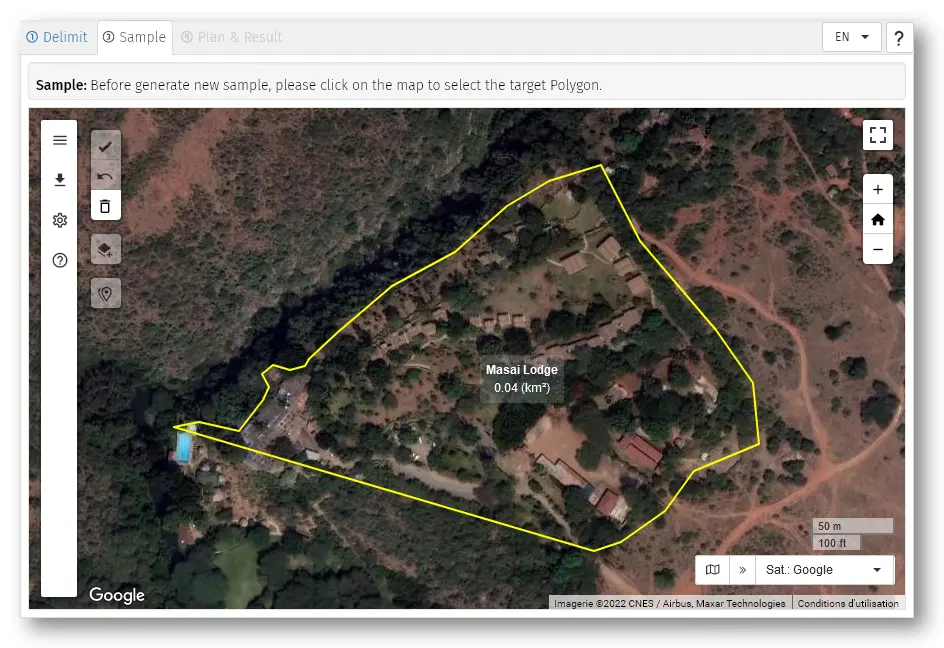

### Steps

1. Select the polygon to sample

2. Click the button **New Sample...** (`r epi.icons::icon_mdi('map-marker-multiple-outline')`). The dialog box **Sample Settings** opens.

    

3. Click on the button  **Generate**.

4. Close the dialog box.

5. Click on the button **Save** (`r epi.icons::icon_mdi('check-bold')`). Confirm with **OK**.

6. Now, you can go to the last step **Result**

::: {.alert .alert-info}
**Notes**:

The precision of the estimate will be increased by increasing the sample size : as much as the sampling units (here, the households) are numerous in the sample, the precision will increase. Outside of these exercises where we do not have enough time to go for a big sample, in real situation, a sample size that would allow sufficient accuracy would rather be around 300-400 households.
:::

[To be allowed to proceed to the next step, after points have been randomly sampled (by any of the two methods above), click on the icon `r epi.icons::icon_mdi('check-bold')` ]{.red-text}

These sampled points (and coordinates) will be exported in the next section (tab "Results").

## Step 4: Results

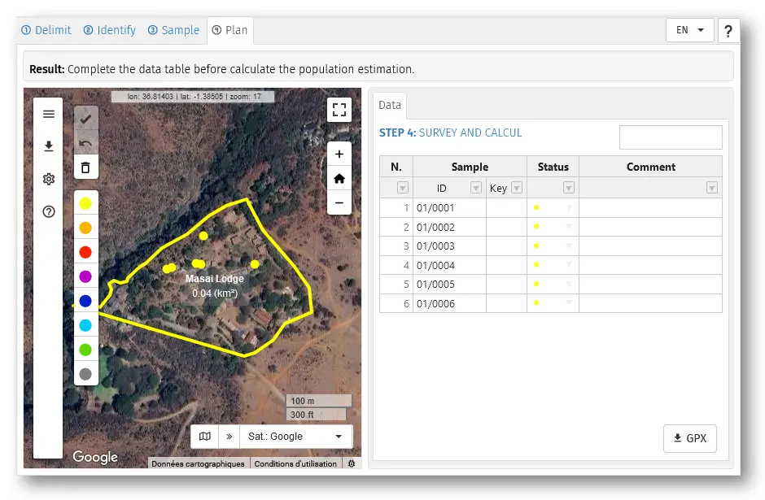

### Steps

1. Select the polygon. You can also observe that the table of results appears in the right window.


2. Export the file of sampled points from `r pkg_infos$title`:

    **Offline** with a GPS  device (Garmin _eTrex_):

    1. Click on the button **GPX** (`r epi.icons::icon_mdi('download')`) and save the file in your computer's disk.
    2. Connect the GPS device to the computer with the adapted USB cable. The GPS device should appear an an accessory/peripheric of the computer in the file explorer of the computer.
    3. Using Windows Explorer (file explorer) ago to the roots of the computer ( C: or D:) and open the _Garmin eTrex_ folder, up to the   .../GPX/... folder.
    4. Copy and paste the .gpx from the hard disk to the folder .../GPX/... folder in  _Garmin eTrex_
    5. Eject the GPS device from the computer and unplug it.

    **Online** with a smartphone without camera:

    1. Click on the button **GPX** (`r epi.icons::icon_mdi('download')`) and save the file in your computer's disk.
    2. Sent the **.gpx** file from the computer to an email address which can be accessed from the smarphone.
    3. Open the e-mail app in the smartphone and download the file.
    4. Go to the downloads folder of the smartphone and share the **.gpx** file with Osmand app.

    **Online** with a smartphone with camera:

    1. Click on the button **GPX** (`r epi.icons::icon_mdi('qrcode-scan')`). A window opens with a QR code
    2. Scan this QR code with the smartphone and accept the download.
    3. Go to the downloads folder of the smartphone and share the **.gpx** file with Osmand app.

3. Field survey

    Once the GPS waypoints of the sample is on the smartphone or device, you can perform your survey / RNA  and collect data : retrieve these in the field (see separate procedure if needed) and interview household members

## References

* GPS device and smartphone (Osmand) : _Rapid Mapping & Handling of GPS points_
